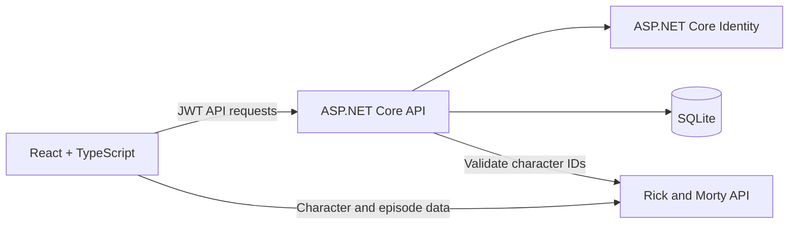

# Rickverse - Rick and Morty Platform

Rickverse is a full-stack character discovery platform built for a Developer Skills Test. Visitors can browse and filter Rick and Morty characters, while registered users can open protected character profiles, review episode appearances, and maintain a personal favorites list.

## Live application

- Frontend: [https://rick-morty-platform-chi.vercel.app](https://rick-morty-platform-chi.vercel.app)
- Backend health check: [https://rick-morty-platform-ecv1.onrender.com/health](https://rick-morty-platform-ecv1.onrender.com/health)
- Source repository: [https://github.com/Pan-y928/rick-morty-platform](https://github.com/Pan-y928/rick-morty-platform)

The Render free service may take a short time to wake after a period of inactivity.

## Features

- Account registration and username/password authentication
- ASP.NET Core Identity password hashing and account lockout
- JWT-based protected API access
- Public character list with name, status, and species filters
- Pagination with first, previous, next, last, and direct page navigation
- Protected character profiles with image, species, gender, status, origin, location, and episode list
- Add or remove favorites from character cards and profile pages
- Protected account profile and saved-characters pages
- Responsive UI, loading states, validation, and user-facing error messages
- Page-level lazy loading and TanStack Query caching
- Automated frontend and backend tests

## Required routes

| Route              | Access        | Purpose                                 |
| ------------------ | ------------- | --------------------------------------- |
| `/`                | Public        | Login page                              |
| `/registration`    | Public        | Account registration                    |
| `/characters`      | Public        | Character list, filters, and pagination |
| `/characters/:id`  | Authenticated | Character profile and episodes          |
| `/user/profile`    | Authenticated | Current account details                 |
| `/user/characters` | Authenticated | Saved favorite characters               |

## Architecture



The backend follows Controller, Service, Data Access, and Domain layers. Interfaces isolate services, repositories, token generation, and the external character client. The frontend groups API functions, types, and reusable hooks by feature.

## Technology stack

### Frontend

- React 19 and TypeScript
- Vite and Tailwind CSS
- React Router
- TanStack Query
- React Hook Form and Zod
- Axios
- Vitest and React Testing Library

### Backend

- ASP.NET Core 9 Web API
- ASP.NET Core Identity
- Entity Framework Core 9
- SQLite
- JWT Bearer authentication
- Swagger / OpenAPI
- xUnit and Moq

### Hosting

- Vercel for the frontend
- Render Docker Web Service for the backend

## Repository structure

```text
rick-morty-platform/
├── frontend/                  React application
├── backend/
│   ├── RickMorty.Api/        ASP.NET Core API
│   ├── RickMorty.Api.Tests/  Backend unit tests
│   └── Dockerfile            Render container definition
├── render.yaml               Render Blueprint configuration
└── README.md
```

## Local installation

### Prerequisites

- Node.js 22 or later
- pnpm 11 or later
- .NET 9 SDK

### 1. Clone the repository

```bash
git clone https://github.com/Pan-y928/rick-morty-platform.git
cd rick-morty-platform
```

### 2. Start the backend

```bash
cd backend/RickMorty.Api
dotnet restore
dotnet user-secrets set "Jwt:Key" "replace-with-a-random-key-at-least-32-characters-long"
dotnet run
```

The API starts at `http://localhost:5048`. EF Core applies pending migrations automatically and creates `rickmorty.db` when required. Swagger is available in Development at `http://localhost:5048/swagger`.

### 3. Start the frontend

Open another terminal from the repository root:

```bash
cd frontend
cp .env.example .env
pnpm install
pnpm dev
```

On Windows PowerShell, replace the copy command with:

```powershell
Copy-Item .env.example .env
```

Open `http://localhost:5173`.

## Environment variables

### Frontend

| Variable            | Local value                 |
| ------------------- | --------------------------- |
| `VITE_API_BASE_URL` | `http://localhost:5048/api` |

### Backend

ASP.NET Core configuration keys use double underscores when supplied as environment variables.

| Variable                               | Purpose                                       |
| -------------------------------------- | --------------------------------------------- |
| `Jwt__Key`                             | JWT signing key; required and never committed |
| `Jwt__Issuer`                          | Token issuer, default `RickMorty.Api`         |
| `Jwt__Audience`                        | Token audience, default `RickMorty.Web`       |
| `Jwt__ExpirationMinutes`               | Token lifetime, default `60`                  |
| `ConnectionStrings__DefaultConnection` | SQLite connection string                      |
| `FrontendOrigin`                       | Deployed frontend origin allowed by CORS      |

## Quality checks

Run the frontend checks:

```bash
cd frontend
pnpm test
pnpm lint
pnpm build
```

Run the backend tests after stopping any locally running API process:

```bash
cd backend
dotnet test RickMortyPlatform.sln -c Release
```

The current suite contains 9 frontend tests and 12 backend tests covering route protection, API error messages, token storage, authentication behavior, JWT generation, and favorite-character business rules.

## Deployment notes

The frontend reads its backend address from `VITE_API_BASE_URL` at build time. The backend reads the Vercel origin from `FrontendOrigin`. See the component-specific guides for full instructions:

- [Frontend guide](frontend/README.md)
- [Backend guide](backend/README.md)

The deployed Render service uses SQLite without a persistent disk. Accounts and favorites can therefore be reset when the service is rebuilt or replaced. This is acceptable for the demonstration environment; a managed relational database would be used for durable production storage.

Character and episode content is supplied by the public [Rick and Morty API](https://rickandmortyapi.com/).
